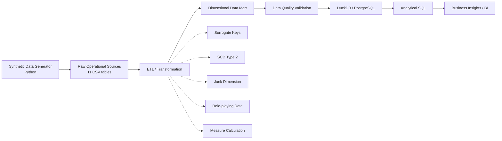
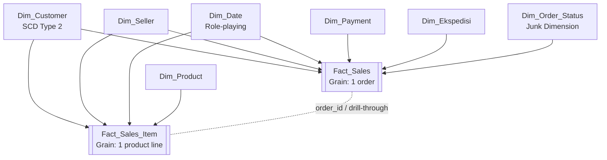

<div align="center">

# 🛒 E-Commerce Data Warehouse & Business Intelligence

### From synthetic operational transactions to an analytics-ready dimensional data mart


**Data Warehouse dan Inteligensi Bisnis — Magister Ilmu Komputer, Universitas Gadjah Mada**

</div>

---

## 📌 Project Overview

Proyek ini membangun **end-to-end e-commerce data warehouse** menggunakan data sintetis yang merepresentasikan proses operasional marketplace: customer melakukan order, membeli satu atau beberapa produk, melakukan pembayaran, memilih ekspedisi, dan mengalami lifecycle transaksi seperti `COMPLETED`, `PROCESSING`, `CANCELLED`, atau `RETURNED`.

Pipeline proyek tidak berhenti pada pembuatan dataset. Raw transactional data ditransformasikan menjadi **dimensional data mart**, divalidasi kualitasnya, dimuat ke **DuckDB**, serta dianalisis menggunakan SQL untuk menjawab pertanyaan bisnis.

> **Catatan:** seluruh customer, seller, produk, transaksi, dan nilai finansial di repository ini bersifat **synthetic** dan tidak merepresentasikan platform e-commerce tertentu.

---

## ✨ Project at a Glance

| Metric | Value |
|---|---:|
| Raw source tables | **11** |
| Orders | **20,000** |
| Order item lines | **45,345** |
| Customers | **4,000** |
| Sellers | **300** |
| Products | **800** |
| Completed orders | **18,014** |
| Customer dengan histori alamat | **708** |
| Bulk-order outliers | **152** |
| High-value outliers | **128** |
| Late deliveries | **1,710** |

---

## 🧭 End-to-End Data Pipeline



---

## 🧱 Data Architecture

### Raw operational layer

Folder [`data/`](data/) berisi source tables yang menyerupai sistem transaksi e-commerce:

```text
data/
├── customers.csv
├── customer_address_history.csv
├── sellers.csv
├── products.csv
├── product_price_history.csv
├── orders.csv
├── order_items.csv
├── payments.csv
├── shipments.csv
├── expeditions.csv
└── payment_methods.csv
```

`orders.csv` memiliki grain **1 row = 1 order**, sedangkan `order_items.csv` memiliki grain **1 row = 1 product line dalam order**.

### Dimensional layer

Folder [`data_mart/`](data_mart/) berisi hasil transformasi:

```text
data_mart/
├── dim_customer.csv
├── dim_date.csv
├── dim_ekspedisi.csv
├── dim_order_status.csv
├── dim_payment.csv
├── dim_product.csv
├── dim_seller.csv
├── fact_sales.csv
└── fact_sales_item.csv
```

Model menggunakan **dua fact table dengan grain berbeda**:

- **`fact_sales`** → 1 row per order
- **`fact_sales_item`** → 1 row per product line dalam order

Secara keseluruhan, model membentuk **fact constellation (galaxy schema)** yang terdiri dari dua star schema dan berbagi conformed dimensions.

---

## ⭐ Dimensional Model



### Why two fact tables?

`Fact_Sales` menyimpan measure yang secara alami berada pada **order level**, seperti shipping fee, grand total, status pembayaran, ekspedisi, dan delivery duration.

`Fact_Sales_Item` menyimpan measure pada **item level**, seperti quantity, unit price, allocated discount, net sales, dan profit per product line.

Pemisahan grain ini membantu mencegah **double counting**. Sebagai contoh, shipping fee satu order tidak perlu diulang pada setiap item produk.

---

## 🔄 ETL Highlights

### 1. Surrogate key mapping

Natural key dari source ditransformasikan menjadi warehouse key:

```text
customer_id          → customer_key
seller_id            → seller_key
product_id           → product_key
expedition_code      → expedition_key
payment_method_code  → payment_key
```

### 2. Slowly Changing Dimension Type 2

Perubahan alamat customer dipertahankan secara historis melalui:

```text
effective_from
effective_to
is_current
```

Dengan demikian, transaksi historis tetap dapat diarahkan ke versi customer yang berlaku pada tanggal transaksi.

### 3. Role-playing date dimension

`Dim_Date` dipakai dalam beberapa peran:

```text
order_date_key
shipped_date_key
delivered_date_key
```

### 4. Junk dimension

Status dan flag ber-cardinality rendah digabung pada `Dim_Order_Status`:

```text
order_status
payment_status
shipment_status
promo_flag
bulk_order_flag
late_delivery_flag
```

### 5. Measure calculation

Beberapa measure dihitung saat transformasi:

```text
net_product_sales = gross_subtotal - total_discount
profit            = net_product_sales - total_hpp
grand_total       = net_product_sales + shipping_fee
```

Diskon pada order level juga dialokasikan secara proporsional ke item agar analisis produk dan kategori tetap dapat dilakukan.

---

## 📊 Analytical Results

Analisis SQL tersedia pada [`scripts/analytic_queries.sql`](scripts/analytic_queries.sql), sedangkan output query disimpan di folder [`result/`](result/).

### 1. Monthly sales trend


Output menunjukkan variasi net product sales bulanan selama periode data. Dataset generator memang memasukkan efek musiman seperti payday, weekend, year-end campaign, dan pertumbuhan transaksi tahun 2026.

### 2. Top sellers by profit


Pada output synthetic dataset ini, **Outlet Amanah 001** berada pada posisi teratas dengan **404 completed orders** dan profit sekitar **Rp153.8 juta**.

### 3. Weekend product demand


Untuk completed orders pada akhir pekan, kategori **Elektronik** memiliki jumlah unit terbesar pada output query, yaitu **10,747 unit**.

---

## 💡 Business Questions

Project menjawab lima pertanyaan analitik utama:

1. **Seller mana yang memberikan kontribusi profit terbesar?**
2. **Bagaimana tren jumlah order, net product sales, dan profit per bulan?**
3. **Provinsi customer mana yang menghasilkan profit terbesar?**
4. **Kategori produk apa yang paling banyak terjual pada saat weekend?**
5. **Ekspedisi apa yang paling banyak digunakan di Jawa Tengah?**

### Selected findings from the generated dataset

| Analysis | Result |
|---|---|
| Top seller by profit | **Outlet Amanah 001** |
| Top customer province by profit | **Jawa Barat** |
| Top weekend category by units | **Elektronik** |
| Most-used expedition in Jawa Tengah | **Lintas Kirim** |

> Temuan di atas adalah hasil dari **synthetic dataset** pada repository ini, bukan statistik pasar e-commerce Indonesia.

---

## ✅ Data Quality Validation

Data mart divalidasi sebelum digunakan untuk analytical query.

Pemeriksaan meliputi:

- duplicate order dan item identifiers;
- unexpected `NULL` pada mandatory keys;
- orphan foreign keys;
- referential integrity;
- header-item reconciliation;
- formula consistency;
- SCD Type 2 overlap;
- multiple current SCD records.

Rekonsiliasi utama:

```text
Fact_Sales.gross_subtotal
    = SUM(Fact_Sales_Item.gross_subtotal)

Fact_Sales.total_discount
    = SUM(Fact_Sales_Item.allocated_discount)

Fact_Sales.net_product_sales
    = SUM(Fact_Sales_Item.net_sales)

Fact_Sales.total_hpp
    = SUM(Fact_Sales_Item.total_hpp)

Fact_Sales.profit
    = SUM(Fact_Sales_Item.profit)
```

---

## 🧪 Transaction Scenarios

Synthetic generator tidak hanya membuat transaksi seragam. Dataset mencakup:

| Scenario | Count |
|---|---:|
| `COMPLETED` | **18,014** |
| `PROCESSING` | **789** |
| `CANCELLED` | **773** |
| `RETURNED` | **424** |
| Bulk orders | **152** |
| High-value orders | **128** |
| Late deliveries | **1,710** |

Hal ini digunakan untuk menghasilkan variasi, outlier, dan skenario perubahan historis yang lebih realistis untuk latihan data warehouse.

---

## 🗂️ Repository Structure

```text
TUGAS_DWBI_Ahmad Hasanuddin/
│
├── data/                  # Raw transactional sources
├── data_mart/             # Dimension & fact CSV
├── database/
│   └── ecommerce_dwbi.duckdb
├── diagrams/              # Schema diagrams
├── report/                # Final report & presentation
├── result/                # Q1–Q5 analytical outputs
├── scripts/
│   ├── generate_dataset.py
│   ├── create_datamart_postgresql.sql
│   ├── analytic_queries.sql
│   └── Tugas_DWBI_Ahmad_Hasanuddin.ipynb
├── assets/                # README charts
└── README.md
```

---

## 🚀 How to Run

### Option A — Google Colab / Jupyter Notebook

Buka:

```text
scripts/Tugas_DWBI_Ahmad_Hasanuddin.ipynb
```

Notebook menjalankan proses generation, dimensional transformation, DuckDB loading, dan analytical query.

### Option B — Python

```bash
python scripts/generate_dataset.py
```

### Option C — PostgreSQL

Gunakan DDL:

```text
scripts/create_datamart_postgresql.sql
```

DDL tersebut mendefinisikan physical data mart, termasuk primary key, foreign key, constraints, dan indexes.

---

## 🗃️ Database

Repository menyertakan database analitik:

```text
database/ecommerce_dwbi.duckdb
```

DuckDB dipilih karena ringan, portable, dan sesuai untuk analisis OLAP berbasis file.

---

## 📄 Reports & Documentation

- 📘 [Final Report](report/Tugas%20DWBI_Ahmad%20Hasanuddin.pdf)
- 🎤 [Presentation](report/Presentasi_Data_Warehouse_and_Business_Intelligence_Ahmad%20Hasanuddin.pdf)
- 🧩 [Schema Diagram](diagrams/SCHEMA.png)
- ⭐ [Star Schema 1](diagrams/STAR%20SCHEMA%201.png)
- ⭐ [Star Schema 2](diagrams/STAR%20SCHEMA%202.png)

---

## 🛠️ Tech Stack

| Area | Technology |
|---|---|
| Data Generation | Python |
| ETL / Transformation | Python |
| Dimensional Modeling | Star Schema / Fact Constellation |
| Analytical Database | DuckDB |
| Relational DDL | PostgreSQL |
| Analytics | SQL |
| Notebook | Jupyter / Google Colab |
| Version Control | Git & GitHub |

---

## 👥 Authors

**Ahmad Hasanuddin**  
**Padmadi Cahyo Wibowo**  
**Edwin Ibrahim Salim**

Magister Ilmu Komputer — Universitas Gadjah Mada

---

<div align="center">

### Data Warehouse & Business Intelligence

**Raw Transactions → ETL → Dimensional Model → Data Quality → Analytics**

</div>
