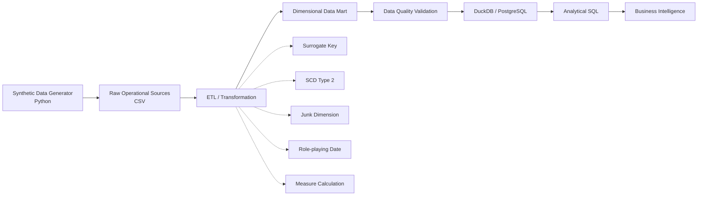
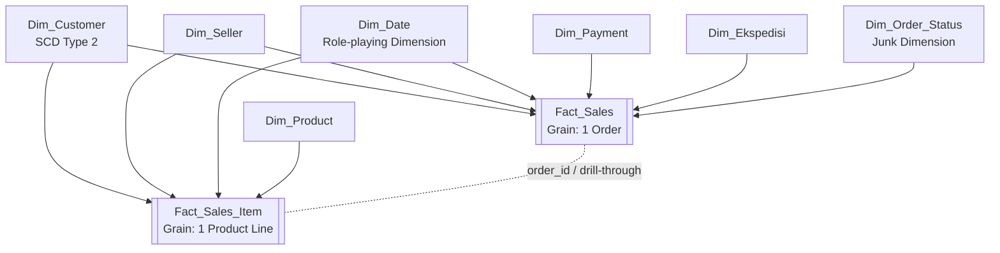

<div align="center">

# 🛒 E-Commerce Data Warehouse & Business Intelligence

### From Synthetic Operational Data to an Analytics-Ready Dimensional Data Mart


**Data Warehouse dan Inteligensi Bisnis**  
**Magister Ilmu Komputer — Universitas Gadjah Mada**

</div>

---

## 📌 Project Overview

Proyek ini merupakan implementasi **Data Warehouse dan Business Intelligence (DWBI)** pada domain **Electronic Commerce**.

Proyek dibangun secara end-to-end, mulai dari pembentukan **synthetic raw transactional data**, proses **ETL**, pembangunan **dimensional data mart**, validasi kualitas data, hingga analisis menggunakan SQL.

Skenario bisnis mensimulasikan aktivitas sebuah marketplace/e-commerce, yaitu customer melakukan order kepada seller, membeli satu atau beberapa produk, melakukan pembayaran, memilih ekspedisi, serta mengalami lifecycle transaksi seperti:

- `COMPLETED`
- `PROCESSING`
- `CANCELLED`
- `RETURNED`

Selain transaksi normal, dataset juga mencakup variasi seperti promo, perubahan harga produk, perubahan alamat customer, bulk order, high-value transaction, dan keterlambatan pengiriman.

> **Disclaimer**  
> Seluruh data dalam repository ini merupakan **synthetic data** yang dibuat untuk tujuan akademik. Dataset tidak berasal dari dan tidak merepresentasikan transaksi aktual dari Shopee, Tokopedia, Lazada, atau platform e-commerce tertentu.

---

# ✨ Project at a Glance

| Metric | Value |
|---|---:|
| Raw source tables | **11** |
| Orders / transactions | **20,000** |
| Order item lines | **45,345** |
| Customers | **4,000** |
| Sellers | **300** |
| Products | **800** |
| Completed orders | **18,014** |
| Customers with address history | **708** |
| Bulk order outliers | **152** |
| High-value order outliers | **128** |
| Late deliveries | **1,710** |

---

# 🧭 End-to-End Data Pipeline



Secara sederhana:

```text
Synthetic Generator
        ↓
Raw Source Data
        ↓
ETL
        ↓
Fact + Dimension
        ↓
Data Mart
        ↓
Data Quality Check
        ↓
DuckDB / PostgreSQL
        ↓
Analytical SQL
        ↓
Business Insight
```

---

# 🗃️ Raw Operational Sources

Raw data disimpan pada:

```text
TUGAS_DWBI_Ahmad Hasanuddin/data/
```

Struktur source data:

```text
data/
├── customers.csv
├── customer_address_history.csv
├── sellers.csv
├── products.csv
├── product_price_history.csv
├── orders.csv
├── order_items.csv
├── payments.csv
├── shipments.csv
├── expeditions.csv
└── payment_methods.csv
```

Dataset tersebut merepresentasikan data operasional sebelum ditransformasikan menjadi dimensional data mart.

---

## 🧑 Customer Source

`customers.csv` berisi master customer, sedangkan:

```text
customer_address_history.csv
```

menyimpan histori perubahan alamat customer.

Histori tersebut digunakan untuk membentuk:

```text
Dim_Customer
```

dengan metode **Slowly Changing Dimension Type 2**.

---

## 🛍️ Order Source

`orders.csv` memiliki grain:

> **1 row = 1 order / transaksi**

Informasi yang disimpan antara lain:

```text
order_id
customer_id
seller_id
order_timestamp
order_status
payment_method_code
expedition_code
promo_code
discount_amount
shipping_fee
gross_subtotal
checkout_total
is_bulk_order
outlier_type
```

Dataset menghasilkan:

```text
20,000 orders
```

---

## 📦 Order Item Source

`order_items.csv` memiliki grain:

> **1 row = 1 product line dalam sebuah order**

Satu order dapat mempunyai beberapa produk sehingga jumlah row pada `order_items.csv` lebih besar dibandingkan `orders.csv`.

Total:

```text
45,345 order item lines
```

Contoh konsep:

```text
ORD00001
│
├── Mouse × 2
├── Keyboard × 1
└── Power Bank × 1
```

Pada `orders.csv`:

```text
ORD00001 → 1 row
```

sedangkan pada `order_items.csv`:

```text
ORD00001 → 3 rows
```

---

# 🔄 ETL Process

ETL digunakan untuk mengubah data operasional menjadi struktur dimensional yang lebih sesuai untuk kebutuhan analitik.

```text
E = Extract
T = Transform
L = Load
```

---

## 1️⃣ Extract

Data diambil dari source seperti:

```text
customers
customer_address_history
sellers
products
product_price_history
orders
order_items
payments
shipments
expeditions
payment_methods
```

---

## 2️⃣ Transform

Beberapa proses transformasi utama yang dilakukan adalah sebagai berikut.

### Surrogate Key Mapping

Natural/business key dari source dipetakan menjadi surrogate key pada data warehouse.

```text
customer_id
      ↓
customer_key


seller_id
      ↓
seller_key


product_id
      ↓
product_key


expedition_code
      ↓
expedition_key


payment_method_code
      ↓
payment_key
```

Tujuan surrogate key adalah memisahkan identifier internal data warehouse dari identifier yang berasal dari source system.

---

### Slowly Changing Dimension Type 2

Perubahan alamat customer ditangani menggunakan:

```text
SCD Type 2
```

dengan atribut:

```text
effective_from
effective_to
is_current
```

Contoh:

```text
customer_id : CUST001
```

Riwayat alamat:

```text
Semarang
    ↓
Yogyakarta
```

Pada data warehouse menjadi:

```text
customer_key | customer_id | city       | effective_from | effective_to | is_current
-------------|-------------|------------|----------------|--------------|-----------
101          | CUST001     | Semarang   | 2024-01-01     | 2025-05-31   | N
4821         | CUST001     | Yogyakarta | 2025-06-01     | 9999-12-31   | Y
```

Dengan pendekatan ini, histori customer tidak hilang ketika atribut berubah.

---

### Role-Playing Date Dimension

Satu `Dim_Date` digunakan untuk beberapa konteks tanggal:

```text
order_date_key
shipped_date_key
delivered_date_key
```

Artinya satu dimension tanggal memainkan beberapa peran berbeda dalam fact table.

---

### Junk Dimension

Atribut status dan flag dengan cardinality rendah digabung ke:

```text
Dim_Order_Status
```

yang terdiri dari:

```text
order_status
payment_status
shipment_status
promo_flag
bulk_order_flag
late_delivery_flag
```

Contoh kombinasi:

```text
COMPLETED
PAID
DELIVERED
Y
N
N
```

dapat direpresentasikan oleh satu:

```text
status_key
```

---

### Measure Calculation

Beberapa measure dihitung selama proses transformasi.

```text
net_product_sales
=
gross_subtotal - total_discount
```

```text
profit
=
net_product_sales - total_hpp
```

```text
grand_total
=
net_product_sales + shipping_fee
```

Pada level item:

```text
net_sales
=
gross_subtotal - allocated_discount
```

```text
profit
=
net_sales - total_hpp
```

---

### Discount Allocation

Diskon berasal dari level order, tetapi untuk melakukan analisis produk, diskon dialokasikan secara proporsional ke setiap product line.

Contoh:

```text
Total Order Discount = Rp100,000
```

```text
Mouse       → Rp50,000
Keyboard    → Rp30,000
Headset     → Rp20,000
              ---------
              Rp100,000
```

Dengan demikian analisis:

```text
net sales per product
profit per product
profit per category
```

dapat dilakukan secara konsisten.

---

## 3️⃣ Load

Hasil transformasi disimpan sebagai dimensional data mart:

```text
TUGAS_DWBI_Ahmad Hasanuddin/data_mart/
```

---

# ⭐ Dimensional Data Mart

Struktur data mart:

```text
data_mart/
├── dim_customer.csv
├── dim_date.csv
├── dim_ekspedisi.csv
├── dim_order_status.csv
├── dim_payment.csv
├── dim_product.csv
├── dim_seller.csv
├── fact_sales.csv
└── fact_sales_item.csv
```

Model menggunakan dua fact table dengan grain berbeda.

---

# 🧩 Fact Constellation



Secara keseluruhan model dapat dikategorikan sebagai:

> **Fact Constellation / Galaxy Schema**

karena terdapat lebih dari satu fact table yang menggunakan beberapa **conformed dimensions** yang sama.

---

# ⭐ Star Schema 1 — Order Level

Pusat analisis:

```text
Fact_Sales
```

Grain:

> **1 row = 1 order**

Dimension:

```text
Dim_Customer
Dim_Seller
Dim_Date
Dim_Payment
Dim_Ekspedisi
Dim_Order_Status
```

Measure utama:

```text
jumlah_item
total_quantity
gross_subtotal
total_discount
net_product_sales
shipping_fee
grand_total
total_hpp
profit
delivery_days
```

Digunakan untuk menganalisis:

- jumlah transaksi;
- sales;
- profit;
- seller performance;
- payment method;
- ekspedisi;
- delivery performance;
- status transaksi.

---

# ⭐ Star Schema 2 — Item Level

Pusat analisis:

```text
Fact_Sales_Item
```

Grain:

> **1 row = 1 product line dalam order**

Dimension:

```text
Dim_Customer
Dim_Seller
Dim_Product
Dim_Date
```

Measure:

```text
quantity
unit_price
unit_hpp
gross_subtotal
allocated_discount
net_sales
total_hpp
profit
```

Digunakan untuk analisis:

- produk terlaris;
- kategori produk;
- jumlah unit terjual;
- net sales produk;
- profit per produk;
- profit per kategori.

---

# ❓ Why Two Fact Tables?

Dua fact table digunakan karena proses bisnis mempunyai **dua tingkat granularitas yang berbeda**.

### `Fact_Sales`

Berada pada level:

```text
ORDER
```

dan cocok untuk measure seperti:

```text
shipping_fee
grand_total
payment
delivery_days
order status
```

### `Fact_Sales_Item`

Berada pada level:

```text
PRODUCT LINE
```

dan cocok untuk:

```text
quantity
product
category
net sales
profit per product
```

Pemisahan ini juga mencegah **double counting**.

Contoh:

```text
ORD001
Shipping Fee = Rp15,000

Item:
Mouse
Keyboard
Headset
```

Jika shipping fee ditempatkan pada setiap item:

```text
Mouse       Rp15,000
Keyboard    Rp15,000
Headset     Rp15,000
```

kemudian dijumlahkan:

```text
Rp45,000
```

padahal ongkos kirim sebenarnya:

```text
Rp15,000
```

Karena itu measure order-level tetap disimpan pada `Fact_Sales`.

---

# 🔗 Conformed Dimensions

Beberapa dimension digunakan bersama oleh kedua fact table:

```text
Dim_Customer
Dim_Seller
Dim_Date
```

Dimension tersebut disebut:

> **Conformed Dimensions**

karena definisi dan maknanya konsisten di seluruh proses analitik.

---

# 🗺️ Source-to-Mart Mapping

| Raw Source | Data Mart Target | Transformation |
|---|---|---|
| `customers + customer_address_history` | `Dim_Customer` | SCD Type 2 |
| `sellers` | `Dim_Seller` | Surrogate Key |
| `products` | `Dim_Product` | Surrogate Key |
| `expeditions` | `Dim_Ekspedisi` | Reference Dimension |
| `payment_methods` | `Dim_Payment` | Reference Dimension |
| Calendar Generator | `Dim_Date` | Role-playing Date |
| `orders + payments + shipments` | `Dim_Order_Status` | Junk Dimension |
| `orders + order_items + payments + shipments` | `Fact_Sales` | Order-level Fact |
| `orders + order_items` | `Fact_Sales_Item` | Item-level Fact |

---

# 📊 Analytical Results

Query analitik disimpan pada:

```text
TUGAS_DWBI_Ahmad Hasanuddin/scripts/
```

Hasil query berada pada:

```text
TUGAS_DWBI_Ahmad Hasanuddin/result/
```

---

## 📈 Monthly Net Product Sales


Grafik menunjukkan perubahan nilai `net_product_sales` antar bulan pada synthetic dataset.

Generator dataset memasukkan beberapa pola untuk membuat transaksi lebih realistis, seperti:

- payday effect;
- weekend effect;
- year-end campaign;
- business growth scenario.

---

## 🏆 Top Sellers by Profit


Analisis hanya menggunakan transaksi dengan:

```text
order_status = COMPLETED
```

agar order cancelled, processing, atau returned tidak diperlakukan sebagai profit final.

---

## 🛍️ Weekend Product Demand


Analisis ini menggunakan:

```text
Fact_Sales_Item
+
Dim_Product
+
Dim_Date
```

untuk mengetahui kategori produk yang paling banyak terjual pada akhir pekan.

---

# 💡 Business Questions

Project ini menjawab lima pertanyaan bisnis utama.

### 1. Seller mana yang memberikan kontribusi profit terbesar?

Analisis menggunakan:

```text
Fact_Sales
+
Dim_Seller
+
Dim_Order_Status
```

---

### 2. Bagaimana tren jumlah order, net product sales, dan profit per bulan?

Analisis menggunakan:

```text
Fact_Sales
+
Dim_Date
```

---

### 3. Provinsi customer mana yang menghasilkan profit terbesar?

Analisis menggunakan:

```text
Fact_Sales
+
Dim_Customer
```

---

### 4. Kategori produk apa yang paling banyak terjual pada weekend?

Analisis menggunakan:

```text
Fact_Sales_Item
+
Dim_Product
+
Dim_Date
```

---

### 5. Ekspedisi apa yang paling banyak digunakan di Jawa Tengah?

Analisis menggunakan:

```text
Fact_Sales
+
Dim_Customer
+
Dim_Ekspedisi
```

---

# 🧪 Data Scenarios

Synthetic dataset tidak hanya berisi transaksi normal.

| Scenario | Count |
|---|---:|
| `COMPLETED` | **18,014** |
| `PROCESSING` | **867** |
| `CANCELLED` | **719** |
| `RETURNED` | **400** |
| Bulk Orders | **152** |
| High-Value Orders | **128** |
| Late Deliveries | **1,710** |

Variasi tersebut digunakan untuk menghasilkan dataset yang lebih sesuai untuk eksperimen data warehouse.

---

# ✅ Data Quality Validation

Sebelum digunakan untuk analisis, data mart melalui proses data quality check.

Pemeriksaan meliputi:

```text
Duplicate Check
NULL Validation
Referential Integrity
Header–Item Reconciliation
Formula Consistency
SCD Type 2 Validation
```

---

## Duplicate Check

Pemeriksaan dilakukan terhadap:

```text
Fact_Sales.order_id
```

dan:

```text
Fact_Sales_Item.order_item_id
```

serta kombinasi:

```text
order_id + line_number
```

untuk memastikan grain masing-masing fact table tetap konsisten.

---

## NULL Validation

Foreign key wajib diperiksa untuk memastikan tidak terdapat nilai `NULL` yang tidak sesuai dengan business rule.

Contohnya:

```text
customer_key
seller_key
product_key
payment_key
expedition_key
order_date_key
status_key
```

Sementara nilai `NULL` pada:

```text
shipped_date_key
delivered_date_key
delivery_days
```

dapat valid secara bisnis karena order tertentu belum dikirim atau belum selesai.

---

## Referential Integrity

Setiap foreign key pada fact table harus mempunyai pasangan pada dimension table.

Contoh:

```text
Fact_Sales.customer_key
        ↓
Dim_Customer.customer_key
```

dan:

```text
Fact_Sales_Item.product_key
        ↓
Dim_Product.product_key
```

---

# 🔍 Header–Item Reconciliation

Karena terdapat dua grain fact, nilai pada order level direkonsiliasi dengan hasil agregasi item.

```text
Fact_Sales.gross_subtotal
=
SUM(Fact_Sales_Item.gross_subtotal)
```

```text
Fact_Sales.total_discount
=
SUM(Fact_Sales_Item.allocated_discount)
```

```text
Fact_Sales.net_product_sales
=
SUM(Fact_Sales_Item.net_sales)
```

```text
Fact_Sales.total_hpp
=
SUM(Fact_Sales_Item.total_hpp)
```

```text
Fact_Sales.profit
=
SUM(Fact_Sales_Item.profit)
```

---

# 🧮 Formula Validation

Business formula juga divalidasi.

```text
grand_total
=
net_product_sales + shipping_fee
```

dan:

```text
profit
=
net_product_sales - total_hpp
```

---

# 🔁 SCD Type 2 Validation

Validasi dilakukan untuk memastikan:

```text
tidak terdapat periode customer yang overlap
```

dan:

```text
setiap customer hanya mempunyai satu record aktif
```

yang ditandai dengan:

```text
is_current = Y
```

---

# 🗄️ Database

Project menggunakan:

## DuckDB

File database:

```text
TUGAS_DWBI_Ahmad Hasanuddin/database/ecommerce_dwbi.duckdb
```

DuckDB digunakan karena:

- ringan;
- portable;
- tidak membutuhkan server;
- cocok untuk analytical workload;
- dapat digunakan langsung dari Python/Jupyter.

---

## PostgreSQL

Repository juga menyediakan DDL PostgreSQL:

```text
TUGAS_DWBI_Ahmad Hasanuddin/scripts/create_datamart_postgresql.sql
```

DDL mendefinisikan:

```text
PRIMARY KEY
FOREIGN KEY
NOT NULL
UNIQUE
CHECK
INDEX
```

DDL digunakan untuk membentuk **physical schema** dari dimensional data mart.

---

# 🧾 Example Analytical Query

Contoh query untuk mencari seller dengan profit terbesar:

```sql
SELECT
    s.seller_id,
    s.seller_name,
    COUNT(f.order_id) AS total_orders,
    SUM(f.net_product_sales) AS revenue,
    SUM(f.profit) AS profit
FROM fact_sales f
JOIN dim_seller s
    ON f.seller_key = s.seller_key
JOIN dim_order_status st
    ON f.status_key = st.status_key
WHERE st.order_status = 'COMPLETED'
GROUP BY
    s.seller_id,
    s.seller_name
ORDER BY profit DESC
LIMIT 5;
```

Filter:

```sql
WHERE st.order_status = 'COMPLETED'
```

digunakan karena profit aktual hanya dianalisis pada transaksi yang telah selesai.

---

# 📂 Repository Structure

```text
ecommerce-data-warehouse-bi/
│
├── README.md
│
├── TUGAS_DWBI_Ahmad Hasanuddin/
│   │
│   ├── assets/
│   │   ├── monthly_net_sales.png
│   │   ├── top_sellers_profit.png
│   │   └── weekend_category_units.png
│   │
│   ├── data/
│   │   ├── customers.csv
│   │   ├── customer_address_history.csv
│   │   ├── sellers.csv
│   │   ├── products.csv
│   │   ├── product_price_history.csv
│   │   ├── orders.csv
│   │   ├── order_items.csv
│   │   ├── payments.csv
│   │   ├── shipments.csv
│   │   ├── expeditions.csv
│   │   └── payment_methods.csv
│   │
│   ├── data_mart/
│   │   ├── dim_customer.csv
│   │   ├── dim_date.csv
│   │   ├── dim_ekspedisi.csv
│   │   ├── dim_order_status.csv
│   │   ├── dim_payment.csv
│   │   ├── dim_product.csv
│   │   ├── dim_seller.csv
│   │   ├── fact_sales.csv
│   │   └── fact_sales_item.csv
│   │
│   ├── database/
│   │   └── ecommerce_dwbi.duckdb
│   │
│   ├── diagrams/
│   │   ├── SCHEMA.png
│   │   ├── STAR SCHEMA 1.png
│   │   └── STAR SCHEMA 2.png
│   │
│   ├── report/
│   │
│   ├── result/
│   │   ├── q1.csv
│   │   ├── q2.csv
│   │   ├── q3.csv
│   │   ├── q4.csv
│   │   └── q5.csv
│   │
│   └── scripts/
│       ├── generate_dataset.py
│       ├── create_datamart_postgresql.sql
│       ├── analytic_queries.sql
│       └── Tugas_DWBI_Ahmad_Hasanuddin.ipynb
│
└── TUGAS_DWBI_Ahmad Hasanuddin.zip
```

---

# 🚀 How to Run

## Option 1 — Google Colab / Jupyter Notebook

Buka:

```text
TUGAS_DWBI_Ahmad Hasanuddin/scripts/Tugas_DWBI_Ahmad_Hasanuddin.ipynb
```

Notebook digunakan untuk menjalankan:

```text
Generate Data
      ↓
ETL
      ↓
Build Data Mart
      ↓
Load DuckDB
      ↓
Data Quality Check
      ↓
Analytical Query
```

---

## Option 2 — Python

Pastikan Python sudah terinstall.

Kemudian jalankan:

```bash
python "TUGAS_DWBI_Ahmad Hasanuddin/scripts/generate_dataset.py"
```

---

## Option 3 — DuckDB

Database siap digunakan tersedia di:

```text
TUGAS_DWBI_Ahmad Hasanuddin/database/ecommerce_dwbi.duckdb
```

Contoh Python:

```python
import duckdb

con = duckdb.connect(
    "TUGAS_DWBI_Ahmad Hasanuddin/database/ecommerce_dwbi.duckdb"
)

print(
    con.execute(
        "SELECT COUNT(*) FROM fact_sales"
    ).fetchall()
)
```

Expected:

```text
20000
```

---

## Option 4 — PostgreSQL

Jalankan:

```text
TUGAS_DWBI_Ahmad Hasanuddin/scripts/create_datamart_postgresql.sql
```

untuk membentuk schema data mart.

Setelah itu data dari:

```text
data_mart/
```

dapat dimuat ke PostgreSQL.

---

# 🖼️ Data Model Diagrams

## Overall Schema

<p align="center">
  
</p>

---

## Star Schema — Order Level

<p align="center">
  
</p>

---

## Star Schema — Item Level

<p align="center">
  
</p>

---

# 📄 Documentation

### Final Report

📘 [Open Final Report](TUGAS_DWBI_Ahmad%20Hasanuddin/report/Tugas%20DWBI_Ahmad%20Hasanuddin.pdf)

### Presentation

🎤 [Open Presentation](TUGAS_DWBI_Ahmad%20Hasanuddin/report/Presentasi_Data_Warehouse_and_Business_Intelligence_Ahmad%20Hasanuddin.pdf)

### Schema

🧩 [Open Schema Diagram](TUGAS_DWBI_Ahmad%20Hasanuddin/diagrams/SCHEMA.png)

### Star Schema

⭐ [Order-Level Star Schema](TUGAS_DWBI_Ahmad%20Hasanuddin/diagrams/STAR%20SCHEMA%201.png)

⭐ [Item-Level Star Schema](TUGAS_DWBI_Ahmad%20Hasanuddin/diagrams/STAR%20SCHEMA%202.png)

---

# 🛠️ Tech Stack

| Area | Technology |
|---|---|
| Synthetic Data Generation | Python |
| ETL / Transformation | Python |
| Data Processing | Python |
| Dimensional Modeling | Star Schema |
| Overall DW Model | Fact Constellation |
| Analytical Database | DuckDB |
| Relational Database | PostgreSQL |
| Analytics | SQL |
| Notebook | Jupyter / Google Colab |
| Version Control | Git & GitHub |

---

# 🎯 Key Concepts Implemented

Project ini menerapkan beberapa konsep utama Data Warehouse:

```text
✓ Grain Definition
✓ Fact Table
✓ Dimension Table
✓ Surrogate Key
✓ Natural Key
✓ Slowly Changing Dimension Type 2
✓ Role-Playing Dimension
✓ Junk Dimension
✓ Degenerate Dimension
✓ Conformed Dimension
✓ Fact Constellation
✓ Additive Measure
✓ Non-Additive Measure
✓ Data Quality Check
✓ Referential Integrity
✓ ETL
✓ OLAP Query
```

---

# 👥 Authors

### Ahmad Hasanuddin

Magister Ilmu Komputer  
Universitas Gadjah Mada

### Padmadi Cahyo Wibowo

Magister Ilmu Komputer  
Universitas Gadjah Mada

### Edwin Ibrahim Salim

Magister Ilmu Komputer  
Universitas Gadjah Mada

---

# 🎓 Course

**Data Warehouse dan Inteligensi Bisnis**

Program Studi Magister Ilmu Komputer  
Fakultas Matematika dan Ilmu Pengetahuan Alam  
Universitas Gadjah Mada

---

# ⚠️ Disclaimer

Dataset pada repository ini merupakan **synthetic dataset** yang dibuat secara programatik untuk keperluan akademik dan pembelajaran.

Data tidak berasal dari transaksi aktual suatu perusahaan atau marketplace tertentu.

Nama:

```text
customer
seller
product
transaction
expedition
financial value
```

bersifat sintetis.

Hasil analisis yang terdapat pada repository merupakan hasil dari dataset sintetis tersebut dan **tidak dapat digunakan sebagai representasi kondisi pasar e-commerce Indonesia secara aktual**.

---

<div align="center">

## 🛒 E-Commerce Data Warehouse & Business Intelligence

### Raw Transactions → ETL → Dimensional Modeling → Data Quality → Analytics

**Built for Data Warehouse & Business Intelligence learning and experimentation**

</div>
